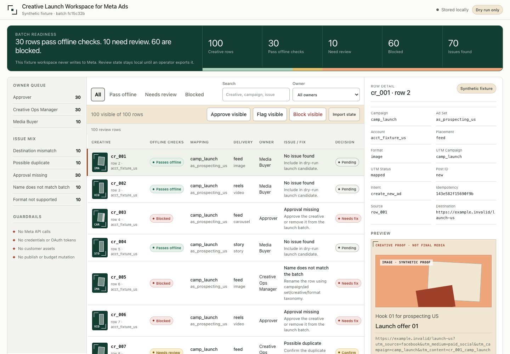

# Creative Launch Workspace for Meta Ads

[](https://github.com/mattyu-dev/creative-launch-workspace/actions/workflows/ci.yml)
[](https://mattyu-dev.github.io/creative-launch-workspace/)
[](LICENSE)

Review a large creative batch, map every row to its campaign and ad set, and resolve launch blockers before anything touches Meta.

**[Open the live synthetic workspace](https://mattyu-dev.github.io/creative-launch-workspace/)**



The current build is an offline product prototype. It works with a 100-row synthetic agency fixture, stores review decisions locally, and cannot publish ads or call the Meta API.

## What the workspace does

1. Reads a CSV manifest of creative rows.
2. Checks approvals, names, destinations, placements, formats, duplicates, UTMs, source lineage, and post intent.
3. Routes each issue to the person who can fix it.
4. Lets an operator review rows, leave notes, approve locally, request fixes, or block export.
5. Exports a local review state and a non-executable platform payload preview.

The review queue is built for batches, not one-off ads. Filters, owner queues, visible-row actions, keyboard navigation, local persistence, guarded state import, and an inspector remain usable across 100 rows.

## Try it

```bash
python3 -m meta_importer.cli plan \
  fixtures/fake_agency_creatives/manifest_v2.csv \
  --out runs/fake_agency_creatives_v2/launch_plan.json \
  --review runs/fake_agency_creatives_v2/review_packet.md \
  --html runs/fake_agency_creatives_v2/workspace.html \
  --html-audit runs/fake_agency_creatives_v2/workspace_audit.json \
  --state runs/fake_agency_creatives_v2/review_state.json \
  --platform-preview runs/fake_agency_creatives_v2/platform_preview.json

open runs/fake_agency_creatives_v2/workspace.html
```

The command writes a standalone HTML workspace. It does not need a server, account, token, or external font.

## What the fixture proves

The supplied fixture contains 100 synthetic rows across 3 campaigns and 10 ad sets:

- 30 rows pass the current offline checks;
- 10 need a reviewer decision;
- 60 are blocked by a concrete issue;
- every row keeps its mapping, source lineage, idempotency key, owner, issue, and proposed fix.

This is fixture and test proof. It does not prove compatibility with a real Meta account.

## Product boundaries

The repository does not:

- call Meta APIs;
- handle OAuth or production access tokens;
- upload customer creative;
- change campaigns, budgets, or spend;
- claim that the payload preview is executable against Meta.

The intended production architecture routes approved files into customer-owned Meta creative surfaces and retains lineage metadata, mappings, review state, and audit events. That architecture is documented but has not been executed with customer data or a real account.

See [customer data trust gates](docs/security/customer_data_trust_gates.md) and [Meta-native asset handoff](docs/platform/meta_native_asset_handoff.md) for the exact approval boundaries.

## Design

The interface uses an original system called Editorial Operations. It grew from a scored review of all 74 systems in the VoltAgent `awesome-design-md` catalogue.

- [Design-system selection and complete ranking](docs/design/design_system_selection.md)
- [Editorial Operations specification](docs/design/editorial_operations_design_system.md)
- [Desktop proof](docs/assets/workspace-desktop.png)
- [Mobile queue proof](docs/assets/workspace-mobile.png)
- [Mobile decision-sheet proof](docs/assets/workspace-mobile-detail.png)

The UI has no gradients, glass effects, external assets, or wall of identical metric cards. Desktop uses a queue and decision inspector. Mobile turns rows into cards and opens the inspector as a focused decision sheet.

## Test it

```bash
python3 -m unittest discover -s tests -q
python3 -m py_compile meta_importer/*.py scripts/*.py tests/*.py
npm ci
npm run qa:frontend
```

The current suite covers manifest parsing, offline checks, mapping contracts, local state, guarded imports, bulk decisions, SQLite fixture persistence, platform-preview guardrails, HTML quality, keyboard hooks, responsive structure, and the no-network boundary. The frontend command rebuilds the fixture, exercises seven responsive widths in Chrome, checks real interactions, writes versioned screenshots, and requires Lighthouse accessibility 100/100 on desktop and mobile.

- [Runtime QA artifact](docs/evidence/workspace-runtime-qa.json)
- [Desktop Lighthouse artifact](docs/evidence/workspace-lighthouse-accessibility-desktop.json)
- [Mobile Lighthouse artifact](docs/evidence/workspace-lighthouse-accessibility-mobile.json)

## Repository map

```text
meta_importer/                     parser, checks, state, storage, HTML workspace
fixtures/fake_agency_creatives/    synthetic manifests and asset-byte fixtures
runs/                              generated local review artifacts
docs/assets/                       versioned frontend screenshots
docs/evidence/                     versioned runtime and Lighthouse evidence
docs/architecture/                 application architecture
docs/product/                      product baseline and PRD
docs/design/                       design audit and interface system
docs/platform/                     Meta contract research and blocked preview model
docs/security/                     data, credential, upload, and mutation gates
docs/qa/                           fixture and browser-quality contracts
```
