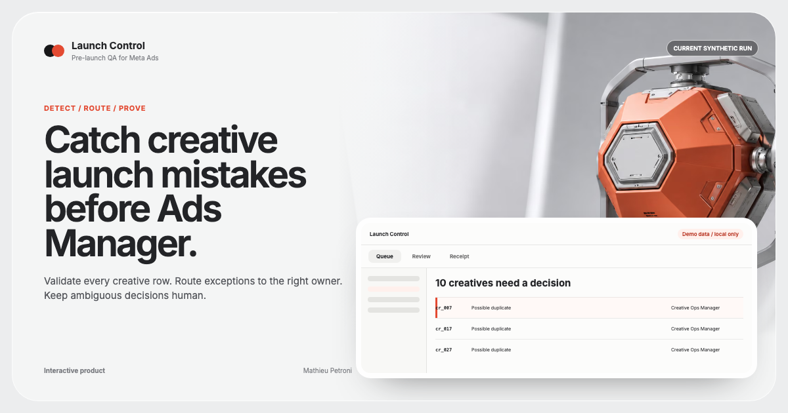

# Creative Launch Workspace

[](https://github.com/mattyu-dev/creative-launch-workspace/actions/workflows/ci.yml)
[](https://github.com/mattyu-dev/creative-launch-workspace/actions/workflows/codeql.yml)
[](https://mattyu-dev.github.io/creative-launch-workspace/)
[](LICENSE)

Catch creative launch mistakes before Ads Manager.

Validate approvals, placements, destinations, naming and UTMs across every creative row. Route exceptions to the right owner. Keep ambiguous decisions human.

**[Try Launch Control](https://mattyu-dev.github.io/creative-launch-workspace/)** · [Open the live workspace](https://mattyu-dev.github.io/creative-launch-workspace/workspace.html?guided=1) · [Explore the full queue](https://mattyu-dev.github.io/creative-launch-workspace/workspace.html) · [Fix and revalidate a blocked row](https://mattyu-dev.github.io/creative-launch-workspace/fix-lab.html)

**Current synthetic run: 100 creative rows · 70 issues routed · 10 human reviews · 0 external writes**

**Mathieu Petroni** designed and built the review workflow, AI orchestration, evaluations, trust boundaries, deterministic validators and responsive interface.

[](https://mattyu-dev.github.io/creative-launch-workspace/)

The V3 public product is a from-scratch Apple and Linear inspired system built with Inter, Instrument Serif accents, a neutral depth shell, charcoal controls and one industrial-orange action color. Queue, Review and Receipt are native interactive states, not screenshots. The only raster image is a new abstract brand sculpture served as AVIF or WebP; it never replaces product proof.

## Why this exists

Creative launches rarely fail because a team cannot make another ad. They fail in the handoff: a destination drifts, an approval is missing, a placement is invalid, a duplicate is unexplained, or a brief never becomes a clean campaign map.

This project turns that handoff into a review queue with named owners, explicit decisions and an audit record.

```text
Brief / manifest
      ↓
bounded mapping proposal
      ↓
schema + evidence + allowlist policy
      ↓
field-level human review
      ↓
deterministic launch QA
      ↓
local review state + non-executable platform preview
```

The system cannot publish ads, call Meta, load tokens, upload customer files, or change spend.

## What the model does

The model has one narrow job: turn ambiguous prose into a typed mapping proposal. It does not control the workflow.

Every field includes:

- a proposed value or an abstention;
- a verbatim evidence quote from the brief;
- evidence strength and an explicitly uncalibrated confidence band;
- a reason code;
- a pending human-review state.

Missing critical information, contradictions, prompt injection, credential signals, customer-data signals, real destinations, invalid values, provider errors, refusals, or malformed output all fail closed.

The default provider is a transparent deterministic baseline for CI. An optional OpenAI Responses API provider uses strict Structured Outputs, no tools, `store=False`, a bounded timeout, and synthetic-data preflight. No live model score is claimed without a real versioned run.

Read the [governed intake evidence](https://mattyu-dev.github.io/creative-launch-workspace/brief-evidence.html), [model card](docs/ai/model_card.md), [evaluation protocol](docs/ai/evaluation.md), and [system architecture](docs/architecture/system.md).

## Fix & Revalidate Lab

The browser lab lets you complete one small review loop without pretending it has a production backend. Change placement, approval and UTM fields on a blocked synthetic row, then replay one of eight versioned scenarios generated by the Python validators.

The browser does not duplicate the validation logic. CI regenerates the [rule pack](docs/evidence/interactive-rule-pack.json) from Python and verifies the committed page stays current.

## Try the full path

```bash
git clone https://github.com/mattyu-dev/creative-launch-workspace.git
cd creative-launch-workspace
uv sync --frozen --all-extras
```

Create a review-only brief proposal:

```bash
uv run --frozen creative-launch brief-propose \
  fixtures/synthetic_campaign_brief.txt \
  --out runs/brief/proposal.json
```

Record an explicit decision for every field, then materialize the accepted mapping into a two-row synthetic manifest and run the existing launch validators:

```bash
uv run --frozen creative-launch brief-review runs/brief/proposal.json \
  --brief fixtures/synthetic_campaign_brief.txt \
  --reviewer 'Synthetic Approver' \
  --decision campaign_key=accepted --decision adset_key=accepted \
  --decision objective=accepted --decision country=accepted \
  --decision language=accepted --decision placement=accepted \
  --decision destination_url=accepted --decision utm_campaign=accepted \
  --out runs/brief/review.json

uv run --frozen creative-launch brief-materialize \
  runs/brief/proposal.json fixtures/synthetic_creative_template.csv \
  --brief fixtures/synthetic_campaign_brief.txt \
  --reviewer 'Synthetic Approver' \
  --decision campaign_key=accepted --decision adset_key=accepted \
  --decision objective=accepted --decision country=accepted \
  --decision language=accepted --decision placement=accepted \
  --decision destination_url=accepted --decision utm_campaign=accepted \
  --out-receipt runs/brief/materialization-review.json \
  --out-manifest runs/brief/reviewed-manifest.csv \
  --out-plan runs/brief/materialization.json
```

Materialization performs the review again in the same process. A saved review receipt is inspectable evidence, not an authorization token.

Run the 36-case benchmark:

```bash
uv run --frozen creative-launch brief-eval \
  --dataset evals/brief_mapping/dataset_v1.jsonl \
  --out runs/evals/brief-mapping.json
```

The dataset also contains 12 natural-prose/adversarial cases reserved for a repeated live-provider run:

```bash
uv run --frozen creative-launch brief-eval \
  --dataset evals/brief_mapping/dataset_v1.jsonl \
  --provider openai --model gpt-5.6-terra --repetitions 3 \
  --out runs/evals/openai-live.json
```

Build the 100-row workspace:

```bash
uv run --frozen creative-launch plan \
  fixtures/fake_agency_creatives/manifest_v2.csv \
  --out runs/launch/plan.json \
  --review runs/launch/review.md \
  --html runs/launch/workspace.html \
  --html-audit runs/launch/audit.json \
  --state runs/launch/state.json \
  --platform-preview runs/launch/platform-preview.json \
  --sqlite-db runs/launch/workspace.sqlite3
```

Open `runs/launch/workspace.html`. Filter blocked rows, inspect the proposed fix, record a decision, then export the reviewed local state.

### Optional live provider

```bash
uv sync --frozen --all-extras
export OPENAI_API_KEY='...'
uv run --frozen creative-launch brief-propose fixtures/synthetic_campaign_brief.txt \
  --provider openai \
  --model gpt-5.6-terra \
  --out runs/brief/openai-proposal.json
```

Only versioned synthetic fixtures are supported. The brief must include `Data classification: synthetic_fixture_only`, and its SHA-256 must appear in `evals/brief_mapping/manifest.json`; the registry is also bound to the dataset hash. Credential, account-ID, customer-data, email, phone and real-destination signals are checked again before any request. The key is read from the environment and is never written to an artifact.

## What the evidence says

The included 100-row fixture spans three campaigns and ten ad sets:

- 30 rows pass the current offline checks;
- 10 need a reviewer decision;
- 60 are blocked by a concrete issue;
- every row retains mapping, lineage, idempotency, owner, issue and proposed fix.

The repo-native benchmark contains 36 labelled contract cases for the deterministic baseline plus 12 natural-prose and adversarial cases for repeated live-provider evaluation. The deterministic baseline passes every contract gate. That is harness proof, not model-quality proof; no live model score is committed without an authenticated run.

Browser QA exercises seven viewport widths plus dedicated 320×568 guided-decision and product-landing contracts. The small-phone gates require a named home link, logical keyboard order, 44-pixel standalone targets and an above-the-fold primary CTA. QA also doubles rendered landing text at 320 and 768 pixels to reject clipped or horizontally overflowing content. The committed workspace and landing Lighthouse accessibility reports score 100/100 on desktop and mobile, while a separate gate fails any serious or critical WCAG audit even if the category score rounds to 100.

The same QA run completes the guided 1→2→3 decision path, verifies that it creates only browser-local state and audit evidence, and confirms the next pending ambiguous case survives reload. The landing targets at least 90 Lighthouse performance, with an explicit CI variance floor of 89 only while best practices and SEO remain at least 95, LCP stays at or below 2.5 s, CLS at or below 0.1 and total blocking time at or below 200 ms. These are reproducible local Lighthouse measurements, not production RUM.

- [Brief baseline eval](docs/evidence/brief-mapping-baseline-eval.json)
- [Reviewed manifest validation](docs/evidence/reviewed-manifest-validation.json)
- [Runtime browser QA](docs/evidence/workspace-runtime-qa.json)
- [Desktop accessibility](docs/evidence/workspace-lighthouse-accessibility-desktop.json)
- [Mobile accessibility](docs/evidence/workspace-lighthouse-accessibility-mobile.json)
- [Product desktop accessibility](docs/evidence/product-lighthouse-accessibility-desktop.json)
- [Product mobile accessibility](docs/evidence/product-lighthouse-accessibility-mobile.json)
- [Product desktop quality budget](docs/evidence/product-lighthouse-quality-desktop.json)
- [Product mobile quality budget](docs/evidence/product-lighthouse-quality-mobile.json)

## Engineering choices

- installable Python package with a console entry point;
- versioned contracts and deterministic IDs;
- provider isolation and strict Structured Outputs;
- field-level evidence grounding, abstention, review and deterministic materialization;
- a shared fail-closed review policy across browser and SQLite paths;
- real decodable JPEG/MP4 synthetic fixtures with byte and metadata checks;
- reproducible generated artifacts through `SOURCE_DATE_EPOCH`;
- locked `uv` installs, Ruff, mypy on trust boundaries, branch coverage, `pip-audit`, CodeQL and browser QA in CI;
- no network dependency in the static workspace.

## Scope

This is a synthetic, offline reference implementation. It does not prove Meta API compatibility, production tenancy, customer-data safety, model quality, or business impact. The [platform boundary](docs/platform/boundary.md) and [threat model](docs/security/threat_model.md) name what would have to be proven next.

## Repository map

```text
meta_importer/ai/                  proposal contracts, providers, policy, review, evals
meta_importer/                     manifest QA, state, storage, preview, HTML workspace
evals/brief_mapping/               48-case synthetic benchmark and generator
fixtures/                          synthetic brief, manifests and decodable media
docs/evidence/                     versioned eval, browser and accessibility evidence
docs/                              product, architecture, AI, QA, security and design notes
tests/                             unit, negative-path and contract tests
```

MIT licensed. Built by [Mathieu Petroni](https://github.com/mattyu-dev).
